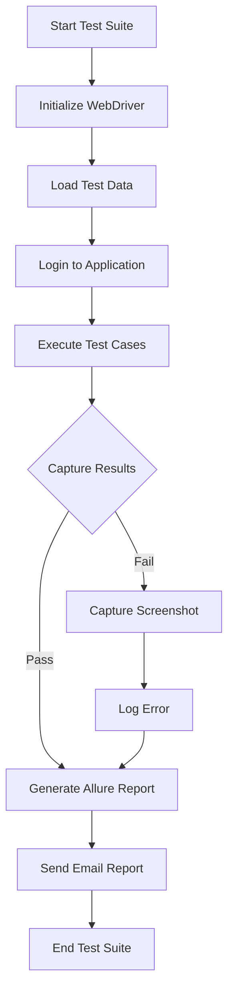
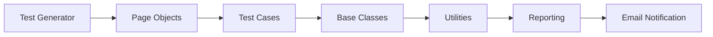
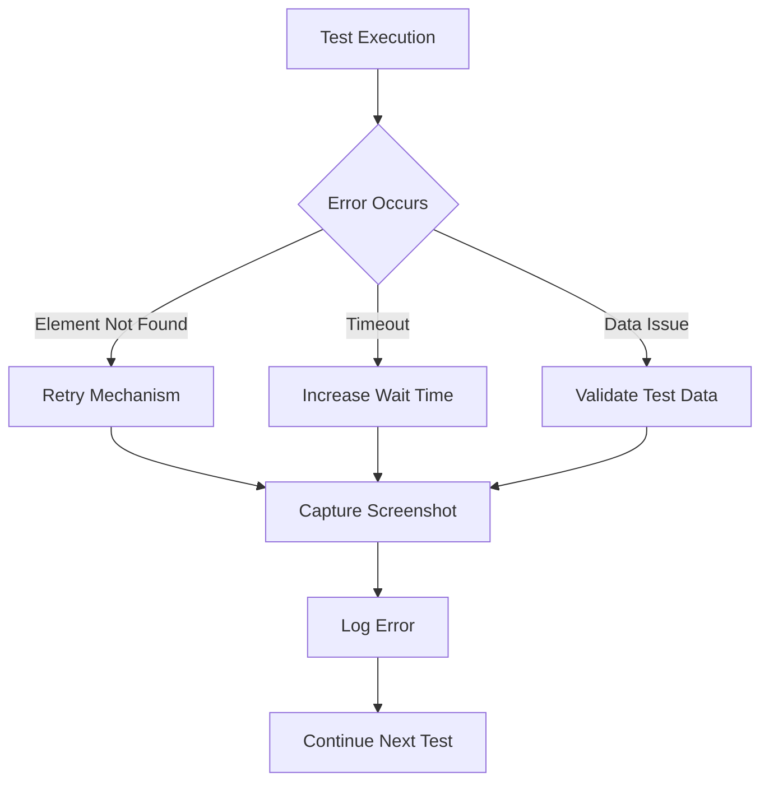
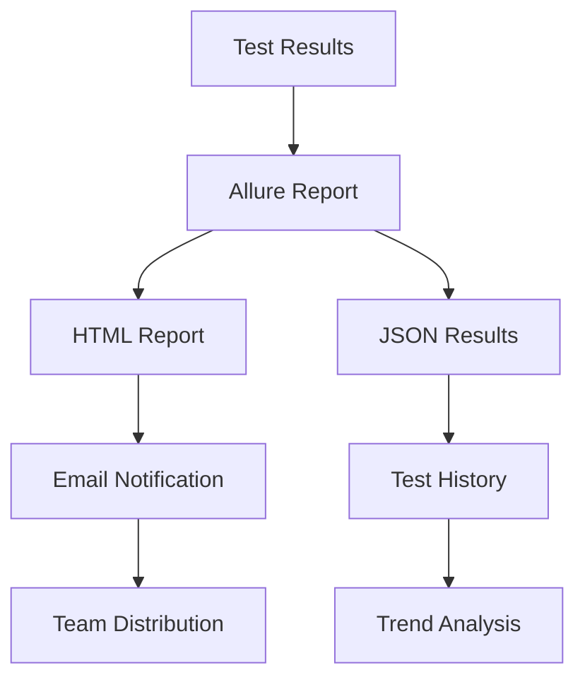

# Technical Workflow Diagram

## Test Execution Flow

```mermaid
graph TD
    A[Start Test Suite] --> B[Initialize WebDriver]
    B --> C[Load Test Data]
    C --> D[Login to Application]
    D --> E[Execute Test Cases]
    E --> F{Capture Results}
    F -->|Pass| G[Generate Allure Report]
    F -->|Fail| H[Capture Screenshot]
    H --> I[Log Error]
    I --> G
    G --> J[Send Email Report]
    J --> K[End Test Suite]
```

## Module Interaction Flow

```mermaid
graph LR
    A[Test Generator] --> B[Page Objects]
    B --> C[Test Cases]
    C --> D[Base Classes]
    D --> E[Utilities]
    E --> F[Reporting]
    F --> G[Email Notification]
```

## Error Handling Flow

```mermaid
graph TD
    A[Test Execution] --> B{Error Occurs}
    B -->|Element Not Found| C[Retry Mechanism]
    B -->|Timeout| D[Increase Wait Time]
    B -->|Data Issue| E[Validate Test Data]
    C --> F[Capture Screenshot]
    D --> F
    E --> F
    F --> G[Log Error]
    G --> H[Continue Next Test]
```

## Reporting Flow

```mermaid
graph TD
    A[Test Results] --> B[Allure Report]
    B --> C[HTML Report]
    B --> D[JSON Results]
    C --> E[Email Notification]
    D --> F[Test History]
    E --> G[Team Distribution]
    F --> H[Trend Analysis]
``` 